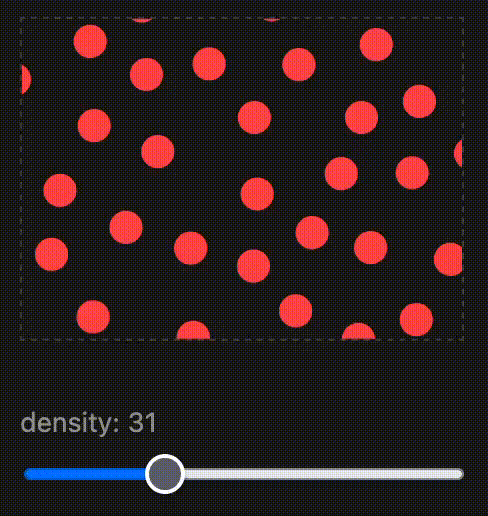

# EtchJS

EtchJS is a tiny (~2kb) JS library that lets you fill elements on webpages with generated backgrounds, like stippling and cross-hatching.



# Usage
Install package

```bash
npm install etchjs
```

## Vanilla JS
Import the library, then add a `data-fill` attribute to any element and the pattern is applied automatically.

```js
import "etchjs/vanilla"; 
```

```html
<div data-fill="stipple" data-fill-density="60" data-fill-color="#ff4d4d"></div>
```


## React

Wrap any element (or use `as` to change the tag) and pass the pattern as props.

```jsx
import { EtchFill } from "etchjs/react";

<EtchFill as="div" type="stipple" density={60} color="#4dd0ff">
	Children
</EtchFill>
```

The pattern is generated client-side only, so it's SSR-safe.

